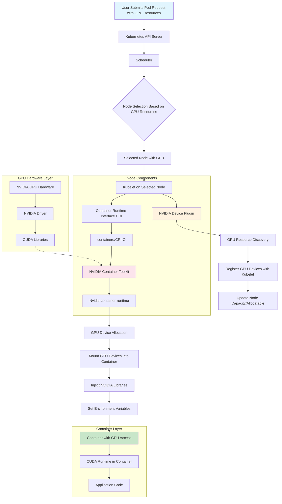

# GPU Workload Failure Diagnosis

## Problem Statement
GPU workloads stuck in `ContainerCreating` state due to container runtime misconfiguration.

## Executive Summary

### What Happened
GPU workload failed because containerd couldn't find the "Nvidia" runtime needed for GPU container creation.

### Impact
- Training/inference jobs cannot access GPU resources
- Workloads stuck in `ContainerCreating`/`ContainerStatusUnknown` state

## GPU Container Enablement Flow

### Architecture Components
1. **Kubernetes Scheduler** - Selects nodes with GPU resources
2. **NVIDIA Device Plugin** - Discovers and advertises GPU devices
3. **Kubelet** - Manages pod lifecycle
4. **Container Runtime (containerd)** - Creates containers
5. **NVIDIA Container Toolkit** - Provides GPU access hooks
6. **GPU Hardware Layer** - Physical NVIDIA GPUs and drivers

### Detailed Flow



### Key Components

#### GPU Device Plugin
- Discovers GPU resources and advertises to Kubernetes
- Manages GPU allocation to pods (DaemonSet)

#### Kubelet
- Node agent managing pod lifecycle
- Communicates with device plugins and container runtime

#### Container Runtime (containerd)
- Creates containers and integrates with NVIDIA Container Toolkit
- Mounts GPU devices into containers

#### NVIDIA Container Toolkit
- Runtime hook for GPU container creation
- Handles device mounting and driver access


## Investigation Process

### Root Cause
Malformed containerd configuration + NVIDIA container toolkit configured for wrong containerd instance.

### Root Cause Analysis

#### Primary Issue: Runtime Configuration
- **Problem**: Malformed container runtime (containerd) configuration couldn't find NVIDIA runtime configurations
- **Error**: `failed to get sandbox runtime: no runtime for "Nvidia" is configured`
- **Details**: System running 2 containerd instances:
  - Kubernetes one: `snap.k8s.containerd.service` under `/var/run/k8s-containerd` (non-standard path)
  - Default one: `containerd.service` (standard convention)
- **Impact**: Kubernetes couldn't start GPU containers or run NVIDIA system containers properly

### Observations

#### Current Workloads Status

```bash
root@192-18-132-31:~/config/gpu-opertor# k get pods -A                                                                                                                                                                                                                                                                                                                                                                                                                                                
NAMESPACE      NAME                                                              READY   STATUS              RESTARTS        AGE                                                                                                                                                                                                                                                                                                                                                                      
default        gpu-textgen                                                       0/1     ContainerCreating   0               23m                                                                                                                                                                                                                                                                                                                                                                      
gpu-operator   gpu-feature-discovery-6hbp9                                       1/1     Running             0               27m                                                                                                                                                                                                                                                                                                                                                                      
gpu-operator   gpu-operator-1758912452-node-feature-discovery-gc-54fc76b7ssrds   1/1     Running             0               27m                                                                                                                                                                                                                                                                                                                                                                      
gpu-operator   gpu-operator-1758912452-node-feature-discovery-master-5cb782bgx   1/1     Running             0               27m                                                                                                                                                                                                                                                                                                                                                                      
gpu-operator   gpu-operator-1758912452-node-feature-discovery-worker-7kv2n       1/1     Running             0               27m                                                                                                                                                                                                                                                                                                                                                                      
gpu-operator   gpu-operator-687f46747c-whzzw                                     1/1     Running             0               27m                                                                                                                                                                                                                                                                                                                                                                      
gpu-operator   nvidia-container-toolkit-daemonset-bhqw6                          0/1     Error               1 (15s ago)     22s                                                                                                                                                                                                                                                                                                                                                                      
gpu-operator   nvidia-cuda-validator-btjl6                                       0/1     Completed           0               26m                                                                                                                                                                                                                                                                                                                                                                      
gpu-operator   nvidia-dcgm-exporter-zb2zm                                        1/1     Running             0               27m                                                                                                                                                                                                                                                                                                                                                                      
gpu-operator   nvidia-device-plugin-daemonset-7npm6                              1/1     Running             0               27m                                                                                                                                                                                                                                                                                                                                                                      
gpu-operator   nvidia-operator-validator-gbcq4                                   1/1     Running             0               27m                                                                                                                                                                                                                                                                                                                                                                      
kube-system    cilium-dwwp7                                                      1/1     Running             0               27h                                                                                                                                                                                                                                                                                                                                                                      
kube-system    cilium-operator-77cb9d9846-snntr                                  1/1     Running             1 (5h33m ago)   27h                                                                                                                                                                                                                                                                                                                                                                      
kube-system    coredns-768cd58769-cbsxv                                          1/1     Running             0               25h                                                                                                                                                                                                                                                                                                                                                                      
kube-system    metrics-server-dfdccbf76-62m8j                                    1/1     Running             0               27h      
```

### GPU workload debug script

A comprehensive cluster-wide GPU debugging script was developed to automate the diagnosis process. This script analyzes GPU configuration across all nodes in the cluster and provides detailed reports on:

- Container runtime configuration issues
- NVIDIA device plugin status
- Container toolkit configuration
- GPU resource availability
- Pod status and events

**Script Location**: [`task1/scripts/cluster_wide_gpu_debug.py`](./scripts/cluster_wide_gpu_debug.py)

**Usage**:
```bash
root@192-18-132-31:~# python3 cluster_wide_gpu_debug.py --namespace gpu-operator --max-workers 5 | less

🚀 Starting cluster-wide GPU configuration analysis...
📊 Found 1 nodes in cluster
🔍 Analyzing node: 192-18-132-31
  ⏳ Waiting for pod to be ready...
✅ Completed analysis for 192-18-132-31

🧹 Cleaning up debug pods...

====================================================================================================
CLUSTER-WIDE GPU CONFIGURATION ANALYSIS REPORT
====================================================================================================

📋 CLUSTER-LEVEL STATUS:
====================================================================================================

PENDING GPU PODS:
----------------------------------------
  default/gpu-textgen
    Status: Pending
    Node: 192-18-132-31


CONTAINER RUNTIME ERRORS:
----------------------------------------
  No containerd errors found
  NVIDIA Devices:
  No NVIDIA devices found

RUNTIME CONFIGURATION ISSUES:
----------------------------------------
  No runtime configuration issues detected

NVIDIA DEVICE PLUGIN STATUS:
----------------------------------------
  desired: 1
  ready: 1
  available: 1

NVIDIA CONTAINER TOOLKIT STATUS:
----------------------------------------
  Ready: 0/1

NVIDIA GPU OPERATOR HELM CONFIGURATION:
----------------------------------------
  ✅ Helm Release: Found
  ❌ Toolkit Configuration: Invalid
  Missing or incorrect configurations:
    • toolkit.env missing: CONTAINERD_CONFIG=/var/lib/k8s-containerd/k8s-containerd/etc/containerd/config.toml
    • toolkit.env missing: CONTAINERD_SOCKET=/var/lib/k8s-containerd/k8s-containerd/run/containerd/containerd.sock
    • toolkit.env missing: CONTAINERD_RUNTIME_CLASS=nvidia
  Current toolkit configuration:
    enabled: True
    env:[]
    image: container-toolkit
    imagePullPolicy: IfNotPresent
    imagePullSecrets: []
    installDir: /usr/local/nvidia
    repository: nvcr.io/nvidia/k8s
    resources: {}
    version: v1.17.5-ubuntu20.04

📊 NODE-LEVEL SUMMARY:
====================================================================================================

📊 SUMMARY:
  Total nodes analyzed: 1
  Nodes with containerd configs: 1
  Nodes with NVIDIA runtime configured: 1
  Nodes with missing NVIDIA binary: 0
  Nodes with analysis errors: 0

📋 DETAILED NODE ANALYSIS:
----------------------------------------------------------------------------------------------------

🖥️   NODE: 192-18-132-31
--------------------------------------------------
  📄 Containerd Configurations:
    ✅ /host/var/lib/k8s-containerd/k8s-containerd/etc/containerd/config.toml
      Exists: True
      NVIDIA Runtime: ⭕ False

    ✅ /host/etc/containerd/config.toml
      Exists: True
      NVIDIA Runtime: 🎯 True
      ⚠️   BinaryName not specified in config
      Config lines:
        # NVIDIA Container Runtime Configuration
        [plugins."io.containerd.grpc.v1.cri".containerd.runtimes.nvidia]
        [plugins."io.containerd.grpc.v1.cri".containerd.runtimes.nvidia.options]
        BinaryName = "/usr/bin/nvidia-container-runtime"
        # Set NVIDIA as default runtime for GPU workloads
....
....
....

 🔍 GPU Detection Results:
    === GPU DETECTION RESULTS ===
    Node: 192-18-132-31
    Containerd Config:
      Config exists (8904 chars)
    NVIDIA Runtime Binary:
      Found at:
          /usr/local/nvidia/toolkit/nvidia-container-runtime (executable)
          /usr/bin/nvidia-container-runtime (executable)
    Containerd Errors (last hour):
      No containerd errors found
    NVIDIA Devices:
      No NVIDIA devices found
    === END RESULTS ===


🔧 CLUSTER-WIDE RECOMMENDATIONS:
--------------------------------------------------
3. 📝 Verify NVIDIA Container Toolkit installation:
   kubectl get pods -n gpu-operator -o wide

4. 🔧 Fix NVIDIA GPU Operator Helm configuration:
   Update your Helm values to include the required toolkit configuration:

   toolkit:
     enabled: true
     env: []
     image: container-toolkit
     imagePullPolicy: IfNotPresent
     imagePullSecrets: []
     installDir: /usr/local/nvidia
     repository: nvcr.io/nvidia/k8s
     resources: {}
     version: v1.17.5-ubuntu20.04
     env:
     - name: CONTAINERD_CONFIG
       value: /var/lib/k8s-containerd/k8s-containerd/etc/containerd/config.toml
     - name: CONTAINERD_SOCKET
       value: /var/lib/k8s-containerd/k8s-containerd/run/containerd/containerd.sock
     - name: CONTAINERD_RUNTIME_CLASS
       value: nvidia

   Then upgrade the Helm release:
   helm upgrade gpu-operator-1758912452 nvidia/gpu-operator -n gpu-operator -f values.yaml
```
### Analysis 

- **Issue Identification**: 
  - The containerd configuration was malformed with certain configurations, preventing containerd from finding the NVIDIA runtime.
  - Upon further inspection of the Helm chart values for the NVIDIA device plugin and container toolkit, it was 
    configured to integrate with another instance of containerd running on the cluster. There are 2 instances of 
    containerd running: the one `snap.k8s.containerd` is running under '/var/run/k8s-containerd' path, which is not the default 
    configuration path that the NVIDIA container toolkit expects to use.
  - As a result, the Kubernetes system was unable to find the runtime `nvidia` to start the container for the gpu-textgen pod.
  - As a side effect, some of the NVIDIA system pods that try to run with the `nvidia` runtime were also failing to run.
  - Upon further inspection of the containerd configuration file, it was observed that the configuration was not properly set up to work with 
    this instance, causing none of the pods to run or work in a healthy state. 

### Further Diagnosis
- Analyzed pod status and events using `kubectl`
- Examined containerd configuration and logs
- Checked GPU operator, device plugin, and container toolkit pods

## Security Considerations

### Potential Risks
1. **Container Runtime Security**: Malformed configuration exposes security vulnerabilities
2. **Configuration Drift**: Unmonitored changes can introduce security gaps


*Technical overview for ML Engineers, Data Engineers, and Software Engineers.*
