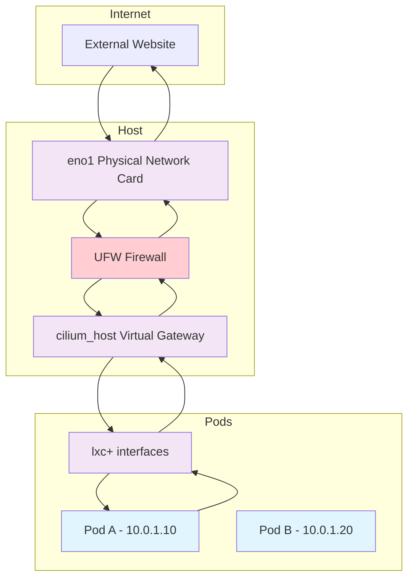

## Kubernetes networking flow

### Traffic Breakdown

1. **Pod Network Architecture**

Pods get IP addresses from the cluster CIDR (e.g., 10.0.0.0/16)

Each pod has a virtual ethernet (veth) pair with names like lxc12345@if4

The cilium_host interface acts as the gateway for pod traffic

2. **Outbound Traffic Flow**

Pod sends packet: Pod A (10.0.1.10) wants to reach external service
veth pair routing: Packet goes through the pod's lxc+ interface
Cilium host interface: Traffic routes to cilium_host (cluster gateway)
eBPF processing: Cilium's eBPF programs handle:

Source NAT (SNAT) - translates pod IP to host IP
Policy enforcement
Load balancing decisions

Host routing: Packet forwarded to physical interface eno1
External delivery: Packet sent to external world with host IP as source

3. **Inbound Traffic Flow**

Response arrives: External response comes to eno1 with host IP
Reverse NAT: Cilium performs destination NAT (DNAT)
eBPF lookup: Determines which pod should receive the packet
Pod delivery: Routes back through appropriate lxc+ interface to target pod

